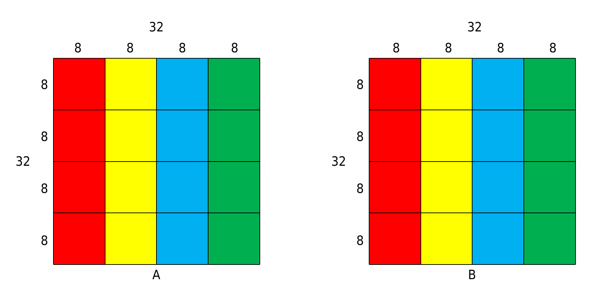
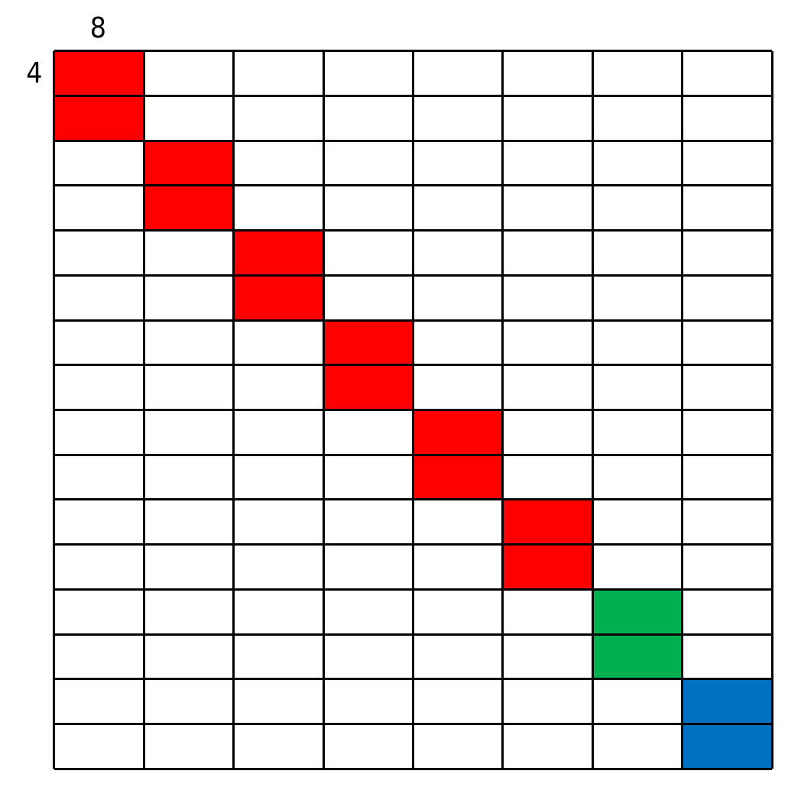
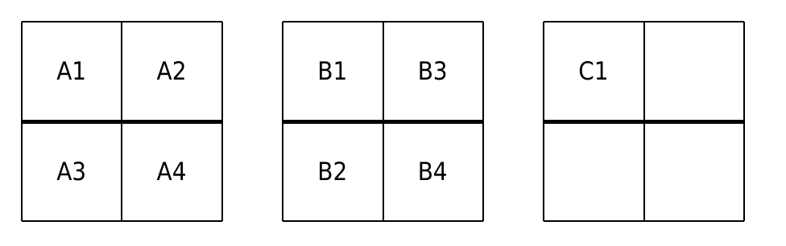
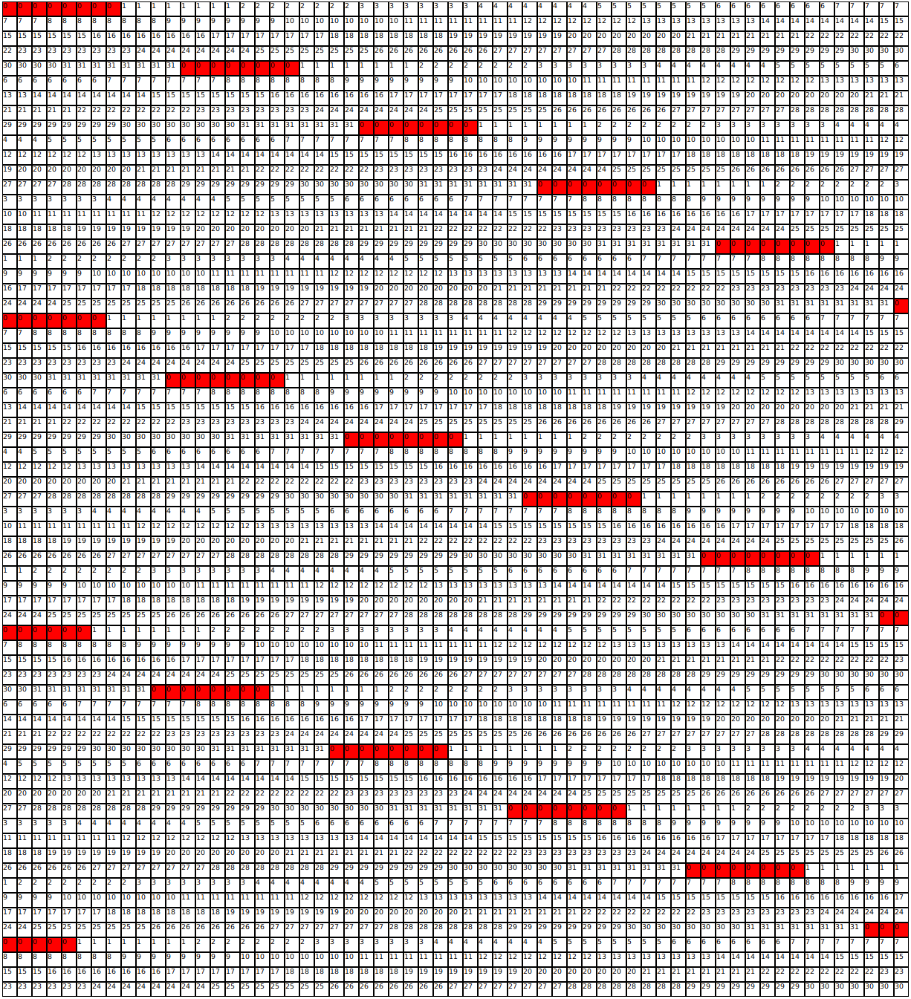

# Chache Lab

## PartA

partA就是个简单的模拟，在此略过，详见`csim.c`。

## partB

本实验的缓存为直接映射，有32个组，每组一行，每行32字节（即8个int）。

### 32*32

```c
void solve_32_32(int A[32][32], int B[32][32])
```

将`32*32`的大矩阵划分为`8*8`的子矩阵。由于是直接映射，简单计算可知图中颜色相同的子矩阵会在缓存中冲突（AB两个数组中颜色相同的子矩阵也会）。所以分别对每个子矩阵从A到B进行转置，这样除了主对角线上的四个子矩阵，其他每个子矩阵都能在至多16次miss内完成转置（A中冷加载8行，存储到B中也是8行）。



```c
for (bi = 0; bi < 32; bi += 8) {
    for (bj = 0; bj < 32; bj += 8) {
        if (bi == bj) continue; // 跳过对角线子矩阵
        for (i = 0; i < 8; ++i) {
            for (j = 0; j < 8; ++j) {
                B[bj + j][bi + i] = A[bi + i][bj + j];
            }
        }
    }
}
```

对于对角线子矩阵需要进行一些单独优化。考察主对角线上的某个A中的源子矩阵a和B中对应位置的目标子矩阵b。a和b中相同编号的行之间冲突，编号不同的行不影响。

一开始用一次miss读出a的第一行全部元素，再用8次miss将其全部放进b的第一列。此时，b的所有行都在缓存中。从第二行开始，处理第i行时，用一次miss读入a的第i行元素，这会驱逐b的对应行。此时缓存中有一个a的行和7个b的行。此时再把这8个数存进b的第i列，这会驱逐缓存中唯一的a的行，而其他b的行已经在缓存中了，只会miss一次。处理完子矩阵总共消耗`1+8+2*7=23`次miss。

```c
for (bi = 0; bi < 32; bi += 8) {
    for (int i = 0; i < 8; ++i) {
        a0 = A[bi + i][bi + 0];
        a1 = A[bi + i][bi + 1];
        a2 = A[bi + i][bi + 2];
        a3 = A[bi + i][bi + 3];
        a4 = A[bi + i][bi + 4];
        a5 = A[bi + i][bi + 5];
        a6 = A[bi + i][bi + 6];
        a7 = A[bi + i][bi + 7];

        B[bi + 0][bi + i] = a0;
        B[bi + 1][bi + i] = a1;
        B[bi + 2][bi + i] = a2;
        B[bi + 3][bi + i] = a3;
        B[bi + 4][bi + i] = a4;
        B[bi + 5][bi + i] = a5;
        B[bi + 6][bi + i] = a6;
        B[bi + 7][bi + i] = a7;
    }
}
```

最终的miss数为`288=16*12+23+4`（最后一个+4在我们实现的函数之外，为框架代码产生）。

### 64*64

图中将AB重叠起来画了，图中处于同一列的`4*8`小方块会在缓存中冲突。



分为三个阶段处理转置。

#### Phase 1

将图中每个白色的（即不在主对角线上的）`8*8`矩阵，以任意一个不处于源和目标所在列上的`8*8`矩阵为中转，进行转置。

将`8*8`的矩阵分成四个`4*4`的部分。下图中A为源，B为目标，C为中转，保证ABC在大图中不处于同一列。



假设C1作为中转一直存在于缓存中，具体转置过程如下：

```
A1 -> B1  load [A1, A2], load [B1, B3]
A2 -> C1  A2 hit
A3 -> B3  evict [A1, A2], load [A3, A4], B3 hit
C1 -> B2  evict [B1, B3], load [B2, B4]
A4 -> B4  A4 hit, B4 hit
```

整个过程中A和B的全部部分都只miss一次，只有加载和驱逐中转的开销。

```c
// ai,aj为源左上角坐标，b为目标，c为中转
void tp_p1(int A[64][64], int B[64][64], int ai, int aj, int bi, int bj, int ci, int cj) {
    int i, j;
    // A1->B1
    for (i = 0; i < 4; ++i) {
        for (j = 0; j < 4; ++j) {
            B[bi + j][bj + i] = A[ai + i][aj + j];
        }
    }
    // A2->C
    for (i = 0; i < 4; ++i) {
        for (j = 0; j < 4; ++j) {
            B[ci + j][cj + i] = A[ai + i][aj + 4 + j];
        }
    }
    // A3->B3
    for (i = 0; i < 4; ++i) {
        for (j = 0; j < 4; ++j) {
            B[bi + j][bj + 4 + i] = A[ai + 4 + i][aj + j];
        }
    }
    // C->B2
    for (i = 0; i < 4; ++i) {
        for (j = 0; j < 4; ++j) {
            B[bi + 4 + i][bj + j] = B[ci + i][cj + j];
        }
    }
    // A4->B4
    for (i = 0; i < 4; ++i) {
        for (j = 0; j < 4; ++j) {
            B[bi + 4 + j][bj + 4 + i] = A[ai + 4 + i][aj + 4 + j];
        }
    }
}
// 对称处理关于主对角线对称的两个小矩阵
void tp_p1_d(int A[64][64], int B[64][64], int ai, int aj, int ci, int cj) {
    tp_p1(A, B, ai, aj, aj, ai, ci, cj);
    tp_p1(A, B, aj, ai, ai, aj, ci, cj);
}

// main
for (ci = 0; ci < 64; ci += 8) {
    for (cj = ci + 8; cj < 64; cj += 8) {
        // 中转小矩阵的选择只需要和源以及目标不在同一列就行
        if (ci == 0) { // 特殊处理第一行/第一列
            // 在不冲突的情况下选择最右下角的那个矩阵作为中转
            // 冲突的第一行最后一个/第一列最后一个，使用倒数第二行倒数第二列的小矩阵作为中转
            if (cj < 56) tp_p1_d(A, B, ci, cj, 56, 56);
            else tp_p1_d(A, B, ci, cj, 48, 48);
        } else {
            // 其他的全部选择最左上角的小矩阵进行中转
            tp_p1_d(A, B, ci, cj, 0, 0);
        }
    }
}
```

#### Phase 2

转置主对角线上除了最后两个之外的`8*8`小矩阵（即图中红色小矩阵）。

每个小矩阵的转置需要两个中转，用C1和C2指代。

具体做法是将源的前四行复制进C1的前4行，源的后四行复制进C2的前4行，然后再转置回目标中。

整个过程中源和目标的全部部分都只miss一次。这里选择右下角紧接着的两个矩阵作为中转，这样与下面将要用到的缓存区域有重合，减少miss。

```c
// a为要处理的小矩阵左上角坐标，因为在对角线上就只用一个数了
// 源/目标：(a,a) 中转：(a+8,a+8)和(a+16,a+16)
void tp_p2(int A[64][64], int B[64][64], int a) {
    int i, j;
    for (i = 0; i < 4; ++i) {
        for (j = 0; j < 8; ++j) {
            B[a + 8 + i][a + 8 + j] = A[a + i][a + j];
        }
    }
    for (i = 0; i < 4; ++i) {
        for (j = 0; j < 8; ++j) {
            B[a + 16 + i][a + 16 + j] = A[a + 4 + i][a + j];
        }
    }
    for (i = 0; i < 4; ++i) {
        for (j = 0; j < 4; ++j) {
            B[a + j][a + i] = B[a + 8 + i][a + 8 + j];
            B[a + j][a + 4 + i] = B[a + 16 + i][a + 16 + j];
        }
    }
    for (i = 0; i < 4; ++i) {
        for (j = 0; j < 4; ++j) {
            B[a + 4 + j][a + i] = B[a + 8 + i][a + 12 + j];
            B[a + 4 + j][a + 4 + i] = B[a + 16 + i][a + 20 + j];
        }
    }
}

// main
for (ci = 0; ci < 48; ci += 8) {
    tp_p2(A, B, ci);
}
```

#### Phase 3

将最后两个小矩阵（图中绿色和蓝色）进行转置。其中绿色以蓝色为中转，蓝色以变量为中转。

对于绿色矩阵，具体做法是将源的前四行复制进蓝色前四行，然后按照B中的行顺序暴力放进B。后四行同理。

A中全部行会miss一次，B中全部行会miss两次。中转一直在缓存里面。

```c
// 要转置的小矩阵左上角坐标为(48,48)，中转坐标为(56,56)不用传参数了
void tp_p3(int A[64][64], int B[64][64]) {
    int i, j;
    for (i = 0; i < 4; ++i) {
        for (j = 0; j < 8; ++j) {
            B[56 + i][56 + j] = A[48 + i][48 + j];
        }
    }
    for (i = 0; i < 8; ++i) {
        for (j = 0; j < 4; ++j) {
            B[48 + i][48 + j] = B[56 + j][56 + i];
        }
    }
    for (i = 0; i < 4; ++i) {
        for (j = 0; j < 8; ++j) {
            B[56 + i][56 + j] = A[48 + 4 + i][48 + j];
        }
    }
    for (i = 0; i < 8; ++i) {
        for (j = 0; j < 4; ++j) {
            B[48 + i][48 + 4 + j] = B[56 + j][56 + i];
        }
    }
}
// main
tp_p3(A, B);
```

最后转置蓝色小矩阵，将这个`8*8`矩阵分为四个`4*4`部分，和`32*32`矩阵最后处理对角线子矩阵一样使用四个变量中转。miss数分析也是类似，这里略过。

```c
// 要转置的小矩阵左上角坐标为(56,56)不用传参数了
void tp_p4(int A[64][64], int B[64][64]) {
    int ci, cj, i, a0, a1, a2, a3;
    for (ci = 0; ci < 8; ci += 4) {
        for (cj = 0; cj < 8; cj += 4) {
            for (i = 0; i < 4; ++i) {
                a0 = A[56 + ci + i][56 + cj + 0];
                a1 = A[56 + ci + i][56 + cj + 1];
                a2 = A[56 + ci + i][56 + cj + 2];
                a3 = A[56 + ci + i][56 + cj + 3];

                B[56 + cj + 0][56 + ci + i] = a0;
                B[56 + cj + 1][56 + ci + i] = a1;
                B[56 + cj + 2][56 + ci + i] = a2;
                B[56 + cj + 3][56 + ci + i] = a3;
            }
        }
    }
}
// main
tp_p4(A, B);
```

最终的miss数为`1101`，离满分的miss上限还有200次呢（骄傲）

### 61*67

根据上面的经验，分块大法好。注意到这里的满分最多可以有2000的miss，限制比较宽松。而且这不是很对齐的矩阵尺寸很难有什么特殊的方法，于是考虑直接分块搞。

写个程序展示一下矩阵中各个元素在缓存中的组编号，如图：

（这里只放B的，A的因为没用到就不放了，看着怪眼花的）



将0用红色标出，是为了表示这一段红色与前一段红色之间的部分能够填满整个缓存而不产生冲突。

注意到图B中红色部分上下比较对齐。如果分成小方块，红色行之间差21行，列之间差12列，于是直接采用这个分块大小，miss直接达到1940，满分了。

```c
void solve_61_67(int A[67][61], int B[61][67]) {
    const int cx = 21, cy = 12;
    int ci, cj, i, j;
    for (ci = 0; ci < 61; ci += cx) {
        for (cj = 0; cj < 67; cj += cy) {
            for (i = ci; i < min(61, ci + cx); ++i) {
                for (j = cj; j < min(67, cj + cy); ++j) {
                    B[i][j] = A[j][i];
                }
            }
        }
    }
}
```

本来还以为61*67最难的，没想到就这。。（其实还是限制给的太宽松

## Summary

感觉是到现在为止最简单的lab

```
Cache Lab summary:
                        Points   Max pts      Misses
Csim correctness          27.0        27
Trans perf 32x32           8.0         8         288
Trans perf 64x64           8.0         8        1101
Trans perf 61x67          10.0        10        1940
          Total points    53.0        53
```

